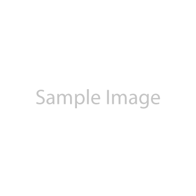

# Context
- This document contain user stories, non-functional requirements, constraints and references by module about this application
- The application name can be inferred from the root folder name where this file is located.
- This is a version controlled document, the version is indicated in the square bracket after each section title, and it will be updated whenever there is any change in the content of that section. The versioning format is [v{major}.{minor}.{patch}] where:
  - Major version will be updated when there is a significant change in the content that may affect the overall understanding of the module or the system.
  - Minor version will be updated when there is a minor change in the content that may affect some details but not the overall understanding of the module or the system.
  - Patch version will be updated when there is a small change in the content that does not affect the overall understanding of the module or the system, such as fixing typos or formatting issues.
- For user any item which is no longer valid or applicable, it will be marked with strikethrough and indicated in the new version.

---

# Standards
- Technical standards which should be referenced all the time in the development of the system.

## UI/UX
- Color and font
  - Primary color: #2271b1 (blue) — used for primary buttons, active states, links, and focused elements.
  - Secondary color: #135e96 (dark blue) — used for hover states on primary elements.
  - Sidebar background: #1d2327 (dark charcoal) — used for the admin sidebar navigation background.
  - Sidebar text: #f0f0f1 (light gray) — used for sidebar menu text and icons.
  - Page background: #f0f0f1 (light gray) — used for the main content area background.
  - Surface/card background: #ffffff (white) — used for cards, panels, form containers, and content blocks.
  - Text primary: #1e1e1e (near black) — used for headings and body text.
  - Text secondary: #646970 (medium gray) — used for helper text, labels, and secondary information.
  - Border color: #c3c4c7 (gray) — used for input borders, dividers, and card outlines.
  - Success color: #00a32a (green) — used for success messages, active status badges, and confirmations.
  - Warning color: #dba617 (amber) — used for warning messages and draft/pending status badges.
  - Error color: #d63638 (red) — used for error messages, validation errors, and destructive action buttons.
  - Border radius: 4px for buttons and inputs, 8px for cards and panels.
  - Font family: System font stack (-apple-system, BlinkMacSystemFont, "Segoe UI", Roboto, Oxygen-Sans, Ubuntu, Cantarell, "Helvetica Neue", sans-serif).

## Coding
- Image manipulation library will be based on the Java library calledd `Scalr` and will be used to:
  - Creating thumbnail version images
  - Resize images to the required size for each section using the `center crop` method to ensure that the aspect ratio is maintained and the image is not distorted.
- Placeholder image will be used for each section when the image is not provided, and the placeholder image will be designed in a way that it can fit well in the section layout and does not affect the overall aesthetics of the website.
- The system will be designed to allow easy addition of new sections in the future by following the existing design and implementation pattern for the current sections, and any new section will be added in a way that it does not affect the existing sections and functionalities of the system.
  - Refer to image:  for 1600x500 pixels image size.
  - Refer to image:  for 400x400 pixels image size.
- For icon use `Fontawesome` icon library for the features section, and the system will provide a predefined list of icons from the `Fontawesome` library for the user to choose from when creating or updating the features section content.

---

# System Module

## Authentication and Authorization

### User Story

[v1.0.0]
- [USA000003] As User, I want to be able to log in using my email and password, so I can access the admin portal
- [USA000006] As User, I want to be able to change my password in case I forgot my password by entering my email address, receive a secure link and set my new password. So I can regain access to the system if I forget my password.
- [USA000009] As User, I want to be able to log out from the system, so I can ensure no unauthorize access using my credential

### Non Functional Requirement

[v1.0.0]
- [NFRA00003] Forgot password function will use typical and secure forgot password flow.

### Constraint

[v1.0.0]

### Reference

[v1.0.0]

---

## User

### User Story

[v1.0.0]
- [USA000012] As User, I want to be able to view my Profile, so I can verify my profile information is correct
- [USA000015] As User, I want to be able to view my Account information, so I can perform change password procedure.
- [USA000018] As Admin, I want to be able to view the list of users, so I can manage the users in the system.
- [USA000021] As Admin, I want to be able to create a new user, so I can add new user to the system.
- [USA000024] As Admin, I want to be able to edit a user, so I can update the user information in the system.
- [USA000027] As Admin, I want to be able to delete a user, so I can remove any user that is no longer relevant or needed in the system.

### Non Functional Requirement

[v1.0.0]
- [NFRA00006] New user information:
  - Email (used as username for login)
  - Password / Confirm password
  - First name
  - Last name
  - Role (USER or ADMIN)
  - Status (ACTIVE or INACTIVE)
- [NFRA00009] For new user role will be set to `User` and `Editor` by default, and only admin user can upgrade the role from `Editor` to `Admin`.
- [NFRA00012] For new user, password will be set to "password" by default, and user will be prompted to change the password upon first login.
- [NFRA00015] On applications startup, system will check if there is any user exist. If not, create a new admin user:
    - Username: admin
    - Password: password (To be changed upon fist login)
    - Role: ADMIN

### Constraint

[v1.0.0]
- [CONSA0003] Only first name and last name can be changed on the User Profile
- [CONSA0006] User status are as follows:
  - ACTIVE (default)
  - INACTIVE (user with INACTIVE status will not be able to log in to the system)
- [CONSA0009] Only user with ADMIN role can access the user management page, and only user with ADMIN role can perform create, edit and delete user action.

### Reference

[v1.0.0]

---

# Business Module

## Hero Section

### User Story

[v1.0.0]
- [USA000030] As Editor, I want to be able to create/update multiple hero section content, so I can highlight any offer or offerings.
  - The hero section will have these information:
    - A large image with the size of 1600x500 pixels
    - A headline text
    - A subheadline text
    - The URL link for the call to action button
    - The text for the call to action button
    - Effective date and expiration date for the hero section content.
    - Status of the hero section as per constraint below.
- [USA000033] As Editor, I want to be able to view the list of hero section content, so I can manage the content easily.
  - Filter option for the list of hero section content:
    - Status (DRAFT, READY, ACTIVE, EXPIRED)
    - Effective date
    - Expiration date
  - The list will be in card format in  a grid layout of 3 columns where each card will show:
    - The thumbnail image
    - The headline text
    - The subheadline text
    - The effective date and expiration date
    - The status of the hero section content
    - Link to the edit page for the hero section content

### Non Functional Requirement

[v1.0.0]
- [NFRA00018] Hero content which already expired will automatically change the status to EXPIRED and will not be shown in the hero section on the website, but it will still be shown in the list of hero section content in the admin portal for record and management purpose.
- [NFRA00021] The image uploaded must be the exact size of 1600x500 pixels, and the system will validate the image size before accepting the upload.
- [NFRA00024] The headline text must be no more than 100 characters, and the subheadline text must be no more than 200 characters. The system will validate the length of the text before accepting the input.
- [NFRA00027] The URL link for the call to action button must be a valid URL format, and the system will validate the URL format before accepting the input.
- [NFRA00030] The text for the call to action button must be no more than 50 characters, and the system will validate the length of the text before accepting the input.
- [NFRA00033] The hero section list will  be ordered by the effective date in descending order.
- [NFRA00036] A thumbnail version of the hero image will be generated automatically by the system with the size of 400x125 pixels, and it will be used in the list of hero section content in the admin portal.

### Constraint

[v1.0.0]
- [CONSA0012] Status of hero content:
  - DRAFT (default)
  - READY
  - ACTIVE
  - EXPIRED

### Reference

[v1.0.0]

---

## Product and Service Section

### User Story

[v1.0.0]
- [USA000036] As Editor, I want to be able to create/update multiple product and service section content, so I can highlight different products and services.
  - The product and service section will have these information:
    - An image with the size of 400x400 pixels
    - A title text
    - A description text
    - The URL link for the call to action button (optional)
    - The text for the call to action button (optional)
    - Status of the product and service section as per constraint below.
- [USA000039] As Editor, I want to be able to set the order of the product and service section content, so I can control the display order of the content on the website.
- [USA000042] As Editor, I want to be able to delete the product and service section content, so I can remove any content that is no longer relevant or needed.
- [USA000045] As Editor, I want to be able to view the list of product and service section content, so I can manage the content easily.
  - Filter option for the list of product and service:
    - Status (DRAFT, INACTIVE, ACTIVE)
  - The list will be in card format in a grid layout of 4 columns where each card will show:
    - The thumbnail image
    - The title text
    - The description text
    - The status of the product and service section content
    - Link to the edit page for the product and service section content
    - Link to delete the product and service section content with a prompt to confirm the deletion action

### Non Functional Requirement

[v1.0.0]
- [NFRA00039] The image uploaded must be the exact size of 400x400 pixels, and the system will validate the image size before accepting the upload.
- [NFRA00042] The title text must be no more than 100 characters, and the system will validate the length of the text before accepting the input.
- [NFRA00045] The description text must be no more than 500 characters, and the system will validate the length of the text before accepting the input.
- [NFRA00048] The URL link for the call to action button must be a valid URL format if it is provided, and the system will validate the URL format before accepting the input.
- [NFRA00051] The text for the call to action button must be no more than 50 characters if it is provided, and the system will validate the length of the text before accepting the input.
- [NFRA00054] The product and service section list will be ordered by the order set by the user in ascending order, and if there is any content with the same order, it will be ordered by the creation date in ascending order.
- [NFRA00057] A thumbnail version of the product and service image will be generated automatically by the system with the size of 200x200 pixels, and it will be used in the list of product and service section content in the admin portal.

### Constraint

[v1.0.0]
- [CONSA0015] Status of product and service content:
  - DRAFT (default)
  - INACTIVE
  - ACTIVE

### Reference

[v1.0.0]

---

## Features Section

### User Story

[v1.0.0]
- [USA000048] As Editor, I want to be able to create/update multiple features section content, so I can highlight different features of the products and services.
  - The features section will have these information:
    - Selection of icon from the predefined icon library
    - A title text
    - A description text
    - Status of the features section as per constraint below.
- [USA000051] As Editor, I want to be able to set the order of the features section content, so I can control the display order of the content on the website.
- [USA000054] As Editor, I want to be able to delete the features section content, so I can remove any content that is no longer relevant or needed.
- [USA000057] As Editor, I want to be able to view the list of features section content, so I can manage the content easily.
  - Filter option for the list of features section content:
    - Status (DRAFT, INACTIVE, ACTIVE)
  - The list will be in card format in a grid layout of 4 columns where each card will show:
    - The icon
    - The title text
    - The description text
    - The status of the features section content
    - Link to the edit page for the features section content
    - Link to delete the features section content with a prompt to confirm the deletion action

### Non Functional Requirement

[v1.0.0]
- [NFRA00060] The title text must be no more than 100 characters, and the system will validate the length of the text before accepting the input.
- [NFRA00063] The description text must be no more than 500 characters, and the system will validate the length of the text before accepting the input.
- [NFRA00066] The features section list will be ordered by the order set by the user in ascending order, and if there is any content with the same order, it will be ordered by the creation date in ascending order.

### Constraint

[v1.0.0]
- [CONSA0018] Status of features content:
  - DRAFT (default)
  - INACTIVE
  - ACTIVE

### Reference

[v1.0.0]

---

## Testimonials Section

### User Story

[v1.0.0]
- [USA000060] As Editor, I want to be able to create/update multiple testimonials section content, so I can highlight different testimonials from customers.
  - The testimonials section will have these information:
    - A customer name
    - A customer review
    - A customer rating (1-5 stars)
    - Status of the testimonials section as per constraint below.
- [USA000063] As Editor, I want to be able to set the order of the testimonials section content, so I can control the display order of the content on the website.
- [USA000066] As Editor, I want to be able to delete the testimonials section content, so I can remove any content that is no longer relevant or needed.
- [USA000069] As Editor, I want to be able to view the list of testimonials section content, so I can manage the content easily.
  - Filter option for the list of testimonials section content:
    - Status (DRAFT, INACTIVE, ACTIVE)
  - The list will be in card format in a grid layout of 4 columns where each card will show:
    - The customer name
    - The customer review
    - The customer rating
    - The status of the testimonials section content
    - Link to the edit page for the testimonials section content
    - Link to delete the testimonials section content with a prompt to confirm the deletion action

### Non Functional Requirement

[v1.0.0]
- [NFRA00069] The customer name must be no more than 100 characters, and the system will validate the length of the text before accepting the input.
- [NFRA00072] The customer review must be no more than 1000 characters, and the system will validate the length of the text before accepting the input.
- [NFRA00075] The customer rating must be an integer between 1 and 5, and the system will validate the rating before accepting the input.
- [NFRA00078] The testimonials section list will be ordered by the order set by the user in ascending order, and if there is any content with the same order, it will be ordered by the creation date in ascending order.

### Constraint

[v1.0.0]
- [CONSA0021] Status of testimonials content:
  - DRAFT (default)
  - INACTIVE
  - ACTIVE

### Reference

[v1.0.0]

---

## Team Section

### User Story

[v1.0.0]
- [USA000072] As Editor, I want to be able to create/update multiple team section content, so I can introduce different team members on the website.
  - The team section will have these information:
    - A profile picture
    - A name
    - A role
    - LinkedIn profile link
    - Status of the team section as per constraint below.
- [USA000075] As Editor, I want to be able to set the order of the team section content, so I can control the display order of the content on the website.
- [USA000078] As Editor, I want to be able to delete the team section content, so I can remove any content that is no longer relevant or needed.
- [USA000081] As Editor, I want to be able to view the list of team section content, so I can manage the content easily.
  - Filter option for the list of team section content:
    - Status (DRAFT, INACTIVE, ACTIVE)
  - The list will be in card format in a grid layout of 4 columns where each card will show:
    - The profile picture
    - The name
    - The role
    - The LinkedIn profile link
    - The status of the team section content
    - Link to the edit page for the team section content
    - Link to delete the team section content with a prompt to confirm the deletion action

### Non Functional Requirement

[v1.0.0]
- [NFRA00081] The profile picture uploaded must be in square format with the size of 400x400 pixels, and the system will validate the image size before accepting the upload.
- [NFRA00084] The name must be no more than 100 characters, and the system will validate the length of the text before accepting the input.
- [NFRA00087] The role must be no more than 100 characters, and the system will validate the length of the text before accepting the input.
- [NFRA00090] The LinkedIn profile link must be a valid URL format, and the system will validate the URL format before accepting the input.
- [NFRA00093] The team section list will be ordered by the order set by the user in ascending order, and if there is any content with the same order, it will be ordered by the creation date in ascending order.

### Constraint

[v1.0.0]
- [CONSA0024] Status of team content:
  - DRAFT (default)
  - INACTIVE
  - ACTIVE

### Reference

[v1.0.0]

---

## Contact Section

### User Story

[v1.0.0]
- [USA000084] As Editor, I want to be able to configure the contact section content, so I can provide the contact information on the website.
  - The contact section will have these information:
    - A phone number
    - An email address
    - A physical address
    - LinkedIn profile link
- [USA000087] As Editor, I want to be able to view list of submitted messages from the contact form on the website, so I can follow up with the inquiries from potential customers.
  - The list of submitted messages will show:
    - The name of the sender
    - The email address of the sender
    - The message content (ellipses if the content is too long)
    - The date and time when the message was submitted
- [USA000090] As Editor, I want to be able to view the details of the submitted message, so I can see the full message content and the contact information of the sender.
  - The message details will show:
    - The name of the sender
    - The email address of the sender
    - The full message content
    - The date and time when the message was submitted
- [USA000093] As Editor, I want to be able to submit a response to the sender of the message, so I can follow up with the inquiries from potential customers.
  - The response will be sent to the email address of the sender, and it will contain:
    - The name of the responder
    - The email address of the responder
    - The message content
    - The date and time when the response was sent

### Non Functional Requirement

[v1.0.0]
- [NFRA00096] The phone number must be in a valid format, and the system will validate the phone number format before accepting the input.
- [NFRA00099] The email address must be in a valid format, and the system will validate the email address format before accepting the input.
- [NFRA00102] The physical address must be no more than 500 characters, and the system will validate the length of the text before accepting the input.
- [NFRA00105] The LinkedIn profile link must be a valid URL format, and the system will validate the URL format before accepting the input.
- [NFRA00108] The response process must be sent to the sender email using batch job asynchronously, and the system will validate the response content before sending the email.

### Constraint

[v1.0.0]
- [CONSA0027] The contact information will be stored  in database as a single record, and any update to the contact information will overwrite the existing record in the database.

### Reference

[v1.0.0]

---

## Blog

### User Story

[v1.0.0]
- [USA000105] As Editor, I want to be able to create a blog category, so I can organize the blog content into different categories on the website.
  - The blog category will have these information:
    - A name
    - A description
- [USA000108] As Editor, I want to be able to view the list of blog categories, so I can manage the blog categories easily.
  - The list will show:
    - The name of the category
    - The description of the category
    - Link to edit the category
    - Link to delete the category with a prompt to confirm the deletion action
- [USA000096] As Editor, I want to be able to create/update multiple blog content, so I can share different articles and news on the website.
  - The blog content will have these information:
    - A selection of blog category from the list of blog categories created in the system
    - A title
    - A summary
    - A content (rich text)
    - An author name (selection from the list of users with Editor role in the system)
    - An image with the size of 1600x500 pixels
    - Effective date and expiration date for the blog content.
    - Status of the blog content as per constraint below.
- [USA000099] As Editor, I want to be able to delete the blog content, so I can remove any content that is no longer relevant or needed.
- [USA000102] As Editor, I want to be able to view the list of blog content, so I can manage the content easily.
  - Filter option for the list of blog content:
    - Status (DRAFT, READY, ACTIVE, EXPIRED)
    - Effective date
    - Expiration date
  - The list will be in card format in a grid layout of 3 columns where each card will show:
    - The thumbnail image
    - The blog category name
    - The title
    - The summary
    - The author name
    - The effective date and expiration date
    - The status of the blog content
    - Link to the edit page for the blog content
    - Link to delete the blog content with a prompt to confirm the deletion action

### Non Functional Requirement

[v1.0.0]
- [NFRA00111] The image uploaded must be the exact size of 1600x500 pixels, and the system will validate the image size before accepting the upload.
- [NFRA00114] A thumbnail version of the blog image will be generated automatically by the system with the size of 400x125 pixels, and it will be used in the list of blog content in the admin portal.
- [NFRA00117] The title must be no more than 100 characters, and the system will validate the length of the text before accepting the input.
- [NFRA00120] The summary must be no more than 300 characters, and the system will validate the length of the text before accepting the input.
- [NFRA00123] The blog content list will be ordered by the effective date in descending order.
- [NFRA00126] The blog slug will be generated automatically by the system based on the title of the blog content, and it will be used in the URL for the blog content on the website. The system will ensure that the generated slug is unique and does not conflict with any existing slug in the system.
- [NFRA00129] The blog content editor will support rich text editing features, including but not limited to:
  - Text formatting (bold, italic, underline, strikethrough)
  - Heading styles (H1, H2, H3)
  - Bullet points and numbered lists
  - Hyperlinks
  - Image embedding
  - Code blocks
  - Blockquotes
  - The system will validate the content to ensure that it does not contain any malicious code or
- [NFRA00132] The blog content will be stored in HTML format in the database, and the system will sanitize the content to prevent any XSS attack or malicious code injection.

### Constraint

[v1.0.0]
- [CONSA0033] Blog category must be created before creating the blog content, and each blog content must be associated with one blog category.
- [CONSA0036] Blog category cannot be deleted if there is any blog content associated with the category, and the system will show an error message when trying to delete a category that has associated blog content.
- [CONSA0039] The author of the blog content must be a user with Editor role in the system, and the system will validate the author selection before accepting the input.
- [CONSA0030] Status of blog content:
  - DRAFT (default)
  - READY
  - ACTIVE
  - EXPIRED

### Reference

[v1.0.0]

---

